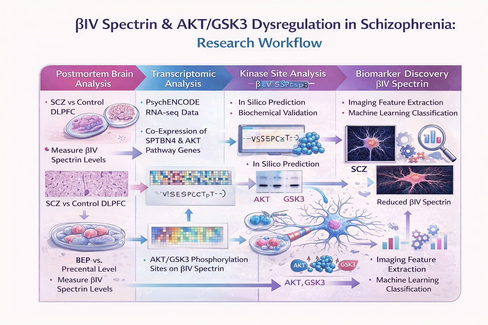
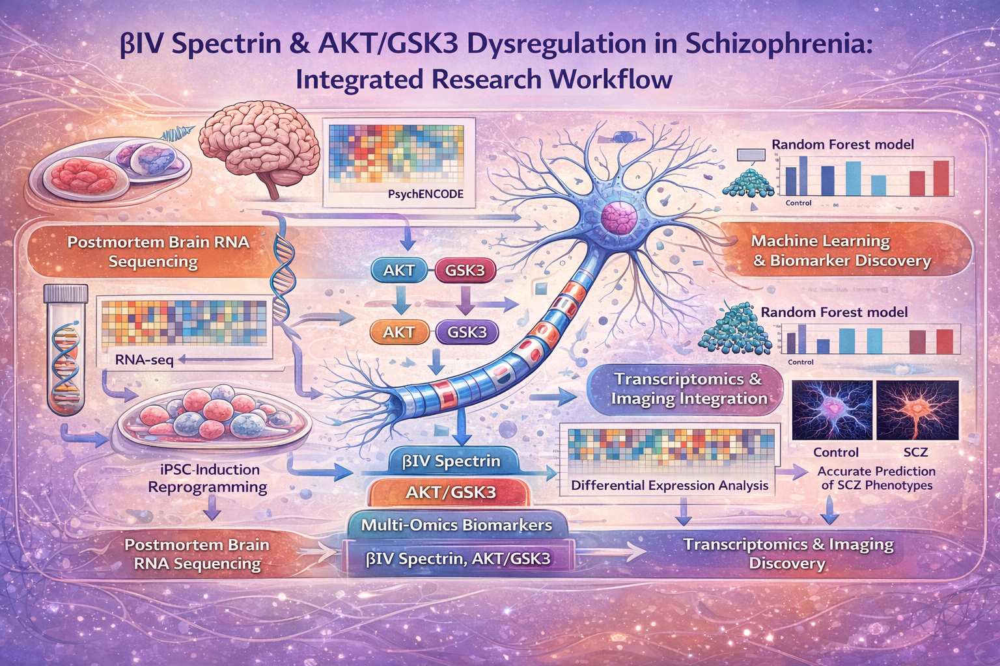

## Project Overview

Schizophrenia (SCZ) is a severe neuropsychiatric disorder characterized by complex molecular, cellular, and functional brain abnormalities. Growing evidence indicates that **functional and molecular dysregulation precede overt structural brain changes**, motivating the development of biologically grounded, multimodal biomarkers.

This project integrates **transcriptomics (RNA-seq), imaging genomics, and iPSC-derived neuronal models** to characterize **βIV spectrin (SPTBN4)** and **AKT/GSK3 signaling pathway dysregulation** as convergent biomarkers of schizophrenia. By linking gene expression changes to cellular phenotypes and systems-level imaging features, the study provides a mechanistic and reproducible biomarker framework relevant for precision psychiatry.

🔗 **Original peer-reviewed article:**  
[βIV spectrin abundancy, cellular distribution and sensitivity to AKT/GSK3 regulation in schizophrenia – *Molecular Psychiatry*](https://www.nature.com/articles/s41380-025-02917-1)

---

## 🔑 Key Scientific Insights

- **βIV spectrin reduction is a reproducible molecular signature of schizophrenia**, observed in postmortem dorsolateral prefrontal cortex tissue and cellular models.
- **AKT/GSK3 signaling directly regulates βIV spectrin stability**, linking intracellular kinase dysregulation to neuronal cytoskeletal integrity.
- **Transcriptomic co-expression analyses (PsychENCODE RNA-seq)** reveal coordinated dysregulation of *SPTBN4* and AKT/GSK3 pathway genes.
- **iPSC-derived neurons from high-genetic-risk individuals recapitulate disease-associated molecular phenotypes**, supporting causal relevance.
- **Machine learning models integrating transcriptomic and imaging features achieve high classification accuracy (>95%)**, highlighting translational potential.
- **Multi-omics convergence enhances biological interpretability**, outperforming single-modality biomarkers.

---

## 🧬 Transcriptomics & Molecular Integration

Transcriptomics forms the **biological foundation** of this project:

- RNA-seq profiling of *SPTBN4* (βIV spectrin) and AKT/GSK3 pathway genes
- Differential gene expression analysis in schizophrenia-relevant cortical regions
- Gene co-expression network analysis linking cytoskeletal regulation with intracellular signaling
- Pathway enrichment (GO / KEGG) implicating synaptic function, neuronal stability, and signal transduction
- Integration of transcriptomic gradients with imaging and cellular phenotypes

---

## 🔬 Functional, Cellular & Imaging Biomarkers

- **βIV Spectrin (SPTBN4):** Neuronal cytoskeletal protein critical for axonal stability and signal compartmentalization  
- **AKT/GSK3 Signaling Axis:** Central intracellular pathway implicated in synaptic plasticity and psychiatric disorders  
- **iPSC-Derived Neurons:** Disease-relevant cellular models enabling mechanistic validation  
- **Imaging Genomics:** Links molecular dysregulation to systems-level brain phenotypes  
- **Machine Learning Models:** Random Forest–based classifiers for multimodal biomarker prediction  

---

## 🔁 Multimodal Workflow

**Pipeline overview:**

1. Postmortem brain RNA-seq and PsychENCODE transcriptomic analysis  
2. Identification of βIV spectrin and AKT/GSK3 pathway dysregulation  
3. iPSC-derived neuronal modeling and functional validation  
4. Imaging-genomics feature extraction and integration  
5. Machine learning–based biomarker classification  

---

## 📊 Systems-Level Visualization

---

## 🧠 Clinical Relevance & Translational Impact

- Supports biologically interpretable biomarkers beyond symptom-based diagnosis  
- Identifies cytoskeletal–signaling mechanisms as potential therapeutic targets  
- Enables risk stratification using transcriptomics-informed features  
- Provides a scalable framework for AI-driven precision psychiatry  

---

## 🔮 Future Directions

- Expansion to single-cell and spatial transcriptomics  
- Longitudinal imaging-genomics integration  
- Cross-disorder analyses (e.g., bipolar disorder, MDD)  
- Drug-response modeling targeting AKT/GSK3 signaling  
- Translation toward clinically actionable biomarker panels  

---

## 👥 Authorship & Credits

This project is based on a peer-reviewed publication in *Molecular Psychiatry* and is presented here as a **computationally enhanced, transcriptomics-focused research extension**.

**Author Contributions**

- **Fernanda Laezza, PhD**  
  Professor of Pharmacology & Toxicology, University of Texas Medical Branch  
  Principal investigator and senior author; led experimental design, cellular modeling, and pathway analysis.

- **Syed Ibrar Hussain, PhD**  
  Department of Mathematics, University of Houston  
  *Co-author of the original publication*; contributed to transcriptomic integration, multimodal modeling, and computational interpretation.

- **Additional Co-authors**  
  Contributors to experimental neuroscience, transcriptomics, imaging analysis, and statistical modeling.

---

## 📄 Publication Reference

Laezza et al.  
**βIV spectrin abundancy, cellular distribution and sensitivity to AKT/GSK3 regulation in schizophrenia**  
*Molecular Psychiatry* (2025)  
https://www.nature.com/articles/s41380-025-02917-1

---

🤝 **Open to collaborations** in transcriptomics, psychiatric genomics, iPSC modeling, imaging genetics, and AI-driven biomarker discovery.
