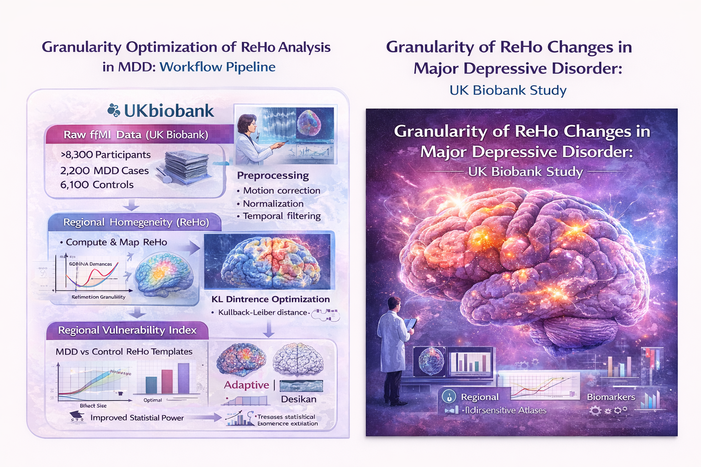

## Project Overview

Major depressive disorder (MDD) is a prevalent psychiatric disorder with complex functional brain alterations. Standard brain atlases often dilute subtle disorder-specific effects in functional MRI analyses. This project introduces a **data-driven, MDD-specific parcellation framework** using **Kullback-Leibler (KL) distance optimization** to define cortical regions that maximize signal-to-noise for Regional Homogeneity (ReHo) measures in UK Biobank resting-state fMRI.

**Original Article:**  
*Exploring the Granularity of Illness-Related Changes in Regional Homogeneity in Major Depressive Disorder using UKBB Data* — Pacific Symposium on Biocomputing (PSB) 2025 / World Scientific  
[DOI: 10.1142/9789819807024_0046](https://www.worldscientific.com/doi/10.1142/9789819807024_0046)

---

## 🔑 Key Highlights

- **Disorder-specific parcellation:** KL distance is used to derive MDD-optimized cortical regions that increase contrast between cases and controls.  
- **Enhanced RVI (Regional Vulnerability Index):** Using MDD-specific regions produces larger effect sizes than standard anatomical atlases (e.g., Desikan).  
- **Large-scale validation:** Dataset includes **2,289 MDD cases and 6,104 healthy controls** from UK Biobank.  
- **Methodological innovation:** Combines functional ReHo mapping with KL distance optimization for precise individual-level biomarkers.  
- **Translational potential:** Provides templates for functional biomarker extraction, stratification, and longitudinal monitoring.  

---

## 🧠 Scientific Background

Functional brain alterations in MDD, particularly measured by ReHo (local BOLD signal synchrony), are **heterogeneous and subtle**. Standard atlas-based approaches average over large regions, reducing sensitivity. The adaptive KL parcellation framework:

- Preserves illness-relevant signal variation  
- Maximizes statistical contrast for individual-level predictions  
- Can be generalized to other psychiatric or neurodegenerative disorders  

---

## 🔬 Methodological Pipeline

**Stepwise workflow:**

1. **Preprocessing:** Resting-state fMRI from UK Biobank processed (motion correction, normalization, filtering).  
2. **ReHo computation:** Local synchrony measured voxel-wise.  
3. **KL parcellation:** Derive data-driven cortical regions maximizing illness effect and SNR.  
4. **RVI computation:** Regional Vulnerability Index calculated with adaptive parcels vs standard atlases.  
5. **Statistical validation:** Large cohort evaluation demonstrates enhanced sensitivity of MDD-specific parcellations.

*Conceptual workflow from raw fMRI to optimized MDD-specific ReHo biomarkers.*

---

## 🧬 Multi-Modal & Translational Integration

While primarily focused on functional MRI, this framework can be extended to **genetics, transcriptomics, and multi-omics data**:

- Integrate **RNA-seq** or **GWAS data** with ReHo-derived regions  
- Link functional vulnerability to molecular signatures  
- Enable mechanistic insights for **precision psychiatry**  
- Supports **cross-disorder comparisons** for schizophrenia, bipolar disorder, etc.
> This multi-modal perspective enhances collaboration opportunities in computational psychiatry, functional genomics, and translational neuroscience.
---

## 🧠 Impact & Applications

- Enables **individualized ReHo biomarker extraction**  
- Increases **statistical power** for translational studies  
- Provides **template for adaptive parcellation** in future studies  
- Facilitates **clinical deployment** for monitoring treatment response  

---

## 👥 Authorship & Credits

This project is based on the PSB 2025 / World Scientific publication:

- **Yewen Huang, PhD** – Conceptualization, algorithm design  
- **Syed Ibrar Hussain, PhD** – Computational modeling, statistical analysis  
- **Paul M. Thompson, PhD** – Neuroimaging genetics expertise  
- **Peter Kochunov, PhD** – Translational psychiatry & imaging  
- **Additional Co-authors:** Demetrio Labate, Robert Azencott, Bhim Adhikari  

---

## 📄 Publication Reference

DOI: [10.1142/9789819807024_0046](https://www.worldscientific.com/doi/10.1142/9789819807024_0046)

---

## 🤝 Collaboration & Future Directions

- Extend **adaptive parcellation framework** to multi-omics datasets (e.g., transcriptomics, proteomics)  
- Comparative atlas studies in **schizophrenia, bipolar disorder, or anxiety**  
- Individual-level **RVI biomarkers for clinical research**  
- Opportunities for collaborations in **computational psychiatry, precision imaging, and multi-modal biomarker discovery**

---
