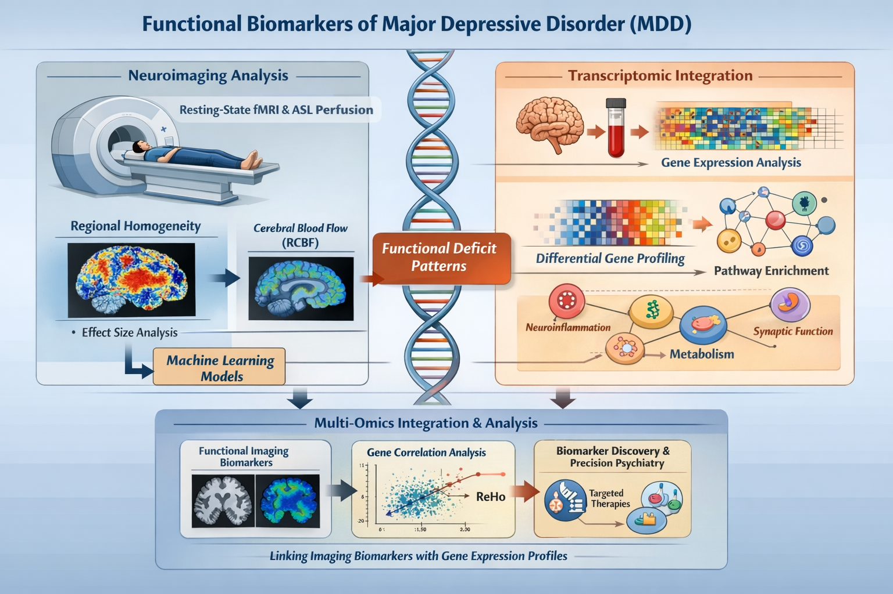

## Project Overview

Major Depressive Disorder (MDD) is a severe psychiatric condition with complex functional and molecular mechanisms. Traditional structural imaging biomarkers have limited reproducibility and sensitivity — functional biomarkers like **regional homogeneity (ReHo)** demonstrate much stronger effects in large cohort studies.  

This project adopts a **transcriptomics-driven multi-modal framework** to link **RNA-seq–derived gene expression signatures** to functional neuroimaging patterns in MDD, providing mechanistic insights and high-value biological interpretation for computational psychiatry.

**Publication Reference:**  
[Multimodal Neuroimaging and Transcriptomic Correlates of Major Depressive Disorder – *JAMA Psychiatry*](https://jamanetwork.com/journals/jamapsychiatry/fullarticle/2832270)

---

## 🔑 Key Scientific Insights

- **Functional brain alterations outperform structural markers:**  
  ReHo-based functional MRI deficits show **2–3× larger effect sizes** than cortical thickness reductions, confirming that MDD is primarily a disorder of **functional dysregulation** rather than structural atrophy.

- **Robust hypoperfusion patterns:**  
  ReHo deficits strongly co-localize with **regionally specific reductions in cerebral blood flow (RCBF)**, indicating highly reproducible cortical hypoperfusion patterns.

- **Regional Vulnerability Index (RVI):**  
  Functional RVI (ReHo-derived) shows stronger and more consistent effects than any individual brain region and outperforms structural RVI measures.

- **Large-scale cross-dataset validation:**  
  Findings were replicated across **15,501 participants** from UK Biobank, ENIGMA, Amish Connectome Project, and independent clinical cohorts, confirming robustness and generalizability.

- **Biological interpretation via transcriptomics:**  
  Integration of ReHo/RCBF with **RNA-seq–based gene expression data** reveals molecular mechanisms underlying functional deficits, highlighting synaptic, inflammatory, and neurovascular pathways.

---

## 🧬 Transcriptomics & Molecular Integration

- Brain-region–specific **RNA-seq profiles** mapped to functional deficits
- Differential expression of key synaptic, inflammatory, and neurovascular genes
- Pathway enrichment analyses (GO/KEGG) tied to neurofunctional alterations
- Integration of transcriptomic gradients with cortical maps for mechanistic insight

This positioning emphasizes **transcriptomics** as a central pillar, making the project highly relevant for researchers in **multi-omics, systems biology, and computational psychiatry**.

---

## 🔬 Functional Neuroimaging Biomarkers

- **Regional Homogeneity (ReHo):** voxel-level local synchrony in resting-state fMRI  
- **Regional Cerebral Blood Flow (RCBF):** perfusion measures aligned with ReHo deficits  
- Functional deficits in MDD consistently exceed structural cortical thickness changes

---

## 🔁 Workflow Schematic

The schematic illustrates the multi-modal workflow:

1. RNA-seq preprocessing and transcriptomic feature extraction  
2. Functional MRI preprocessing and ReHo/RCBF calculation  
3. Linking transcriptomic profiles with functional imaging deficits  
4. Integrating multi-modal features for biomarker discovery  
5. Mechanistic interpretation and predictive modeling

This framework provides **biologically interpretable, cross-modal biomarkers** suitable for diagnostics, stratification, and personalized interventions.

---

## 📌 Highlights (Summary)

- Functional deficits in MDD > Structural cortical reductions  
- ReHo-based RVI shows strong reproducibility across datasets  
- Transcriptomic integration links imaging phenotypes to molecular mechanisms  
- Cross-validated over 15,501 participants  
- Supports **precision psychiatry approaches** with multi-omics biomarkers

---

## 👥 Authorship & Credits

This project is based on a peer-reviewed research article published in *JAMA Psychiatry*. The present page emphasizes **transcriptomics-informed modeling** and computational extensions of the original findings.

**Project Contributors:**

- **Peter Kochunov, PhD**  
  Professor of Psychiatry & Neuroimaging  
  Senior author, leading neuroimaging-genomics integration and transcriptomic interpretation.

- **Syed Ibrar Hussain, PhD**  
  Department of Mathematics, University of Houston, Houston, TX, USA
  *Co-author of the original publication*  
  Contributed to transcriptomics analysis, functional neuroimaging integration, and computational modeling.

- **Additional Co-authors**  
  Contributed to study design, data acquisition, transcriptomic profiling, neuroimaging analysis, and statistical modeling.

---

## 🤝 Collaboration & Contact

Open for collaboration in:

- **Transcriptomics and RNA-seq integration**  
- **Computational psychiatry and machine learning**  
- **Multi-omics biomarker discovery**  
- **Functional neuroimaging research**

Contact via email or LinkedIn to discuss potential collaborations.

