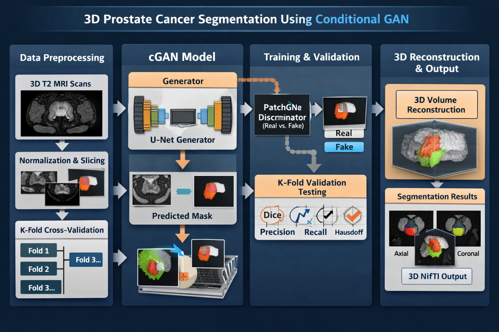

### Project Overview

This project focuses on automatic segmentation of prostate MRI scans using a **Conditional Generative Adversarial Network (cGAN)**. The pipeline integrates volumetric 3D T2-weighted MRI data with advanced deep learning architectures to produce highly accurate slice-wise segmentations, later reconstructed into 3D volumes.

**Key Features:**

- Preprocessing & normalization of 3D MRI volumes
- Slice extraction for efficient training
- U-Net based generator and PatchGAN discriminator
- Adversarial training with combined L1 + GAN loss
- K-Fold cross-validation for robust performance evaluation
- Post-processing & morphological refinement for smooth and accurate segmentation
- Performance metrics: Dice, Precision, Recall, Hausdorff distance

**Repository:** Private (Available upon request)

### GAN Pipeline

The illustration above summarizes the workflow from **raw MRI input → preprocessing → GAN-based segmentation → 3D volume reconstruction → post-processing**. This approach enables automated and reproducible segmentation, facilitating downstream radiomics analysis and clinical decision support.

### Impact & Applications

- Supports reproducible biomedical imaging research
- Enables accurate prostate segmentation for radiomics and AI-driven diagnosis
- Facilitates quantitative assessment of anatomical structures in 3D MRI
- Demonstrates integration of generative AI models for clinical applications

### Technical Details

The pipeline includes:

1. **Data Handling:** 3D NIfTI MRI volumes are normalized and augmented.
2. **Model Architecture:** 3D U-Net generator with PatchGAN discriminator for adversarial learning.
3. **Training Strategy:** Combined L1 reconstruction loss + adversarial loss for realistic and accurate segmentations.
4. **Evaluation:** Dice similarity, Precision, Recall, and Hausdorff distance metrics.
5. **Post-Processing:** Morphological operations refine segmented masks for smooth 3D surfaces.

**Note:** The repository contains sensitive patient data and is **private**. Access can be granted upon request for research collaboration.

